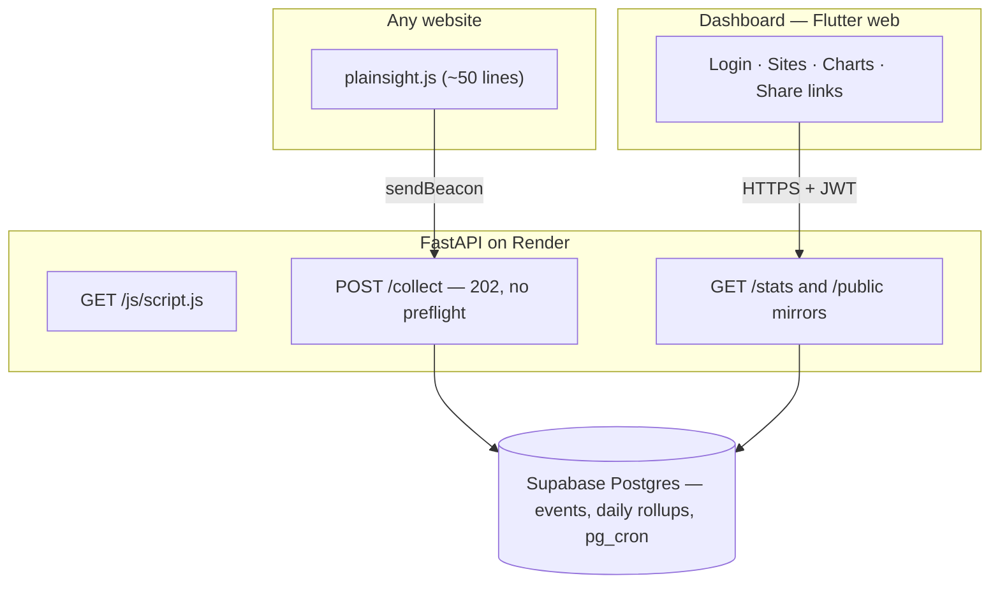

# Plainsight

Privacy-first web analytics you can self-host and actually understand. One ~50-line script, no cookies, no personal data stored — a live dashboard of visitors, pages, referrers, countries and devices.

[](https://github.com/KarimDtwen/plainsight/actions/workflows/ci.yml)


## What it does

- **One-line install** — `<script defer src=".../js/script.js" data-site="KEY">` on any site; SPA route changes are counted too (`pushState` hooks).
- **No cookies, no PII** — visitors are counted with a daily-rotating salted hash (`sha256(daily_salt + site + ip + ua)`) computed server-side; the IP and raw user-agent are never stored, and salts are destroyed after 2 days, making re-identification impossible. Honors Do Not Track.
- **Live dashboard** — visitors/pageviews timeseries, top pages, referrers, countries, devices/browsers, and an "online now" counter.
- **Public share links** — a revocable read-only URL per site, no login needed.
- **Multi-site** — register any number of sites, each with its own key and dashboard.

## Architecture



- Ingestion is a CORS **simple request** (`text/plain` body via `sendBeacon`) — no preflight round-trip, the same trick Plausible uses.
- Historical queries read pre-aggregated `daily_rollups`; today is computed live from raw events and UNIONed in — all inside Postgres functions called via RPC.
- Nightly rollup + 90-day raw-event purge + salt destruction run in the database via **pg_cron** (the Render free tier sleeps, so the app can't be trusted with cron).
- The live counter **polls** every 10 s rather than holding a WebSocket — a deliberate fit for a free tier that cold-starts; the dashboard shows a "waking up" banner instead of failing.

## Status

| Piece | State |
|---|---|
| M0 — scaffold, CI, docs, skills | ✅ this commit |
| M1 — ingestion + snippet + stats API | 🔜 |
| M2 — dashboard + charts | ⬜ |
| M3 — live counter + share links | ⬜ |
| M4 — deploy + dogfood on [UniMatch](https://github.com/KarimDtwen/UniMatch) | ⬜ |
| M5 — polish, screenshots, demo | ⬜ |

## Screenshots

Coming in M5 — the demo dashboard will show **real traffic** from the live UniMatch web app, not seeded data.

## Run the backend locally

```bash
cd backend
python -m venv .venv
.venv/Scripts/pip install -r requirements-dev.txt
cp .env.example .env        # fill in dev values
.venv/Scripts/python -m uvicorn main:app --reload --port 8000
.venv/Scripts/python -m pytest -q
```

## Run the dashboard

```bash
flutter pub get
flutter run -d chrome --web-port 5000 --dart-define=API_BASE_URL=http://localhost:8000
flutter analyze && flutter test
```

## Deployment

Backend → Render ([`render.yaml`](render.yaml), health check `/health`); dashboard → Firebase Hosting ([`firebase.json`](firebase.json)); database → Supabase (hand-numbered SQL in [`backend/migrations/`](backend/migrations/), applied in the SQL editor). Full runbook: [DEPLOYMENT.md](DEPLOYMENT.md).

## Environment & secrets

All configuration is environment variables — see [`backend/.env.example`](backend/.env.example). `backend/.env` is git-ignored; production values live only in the Render dashboard (`sync: false`). Settings are validated at startup and fail fast in production with the **names** of missing variables, never values.
