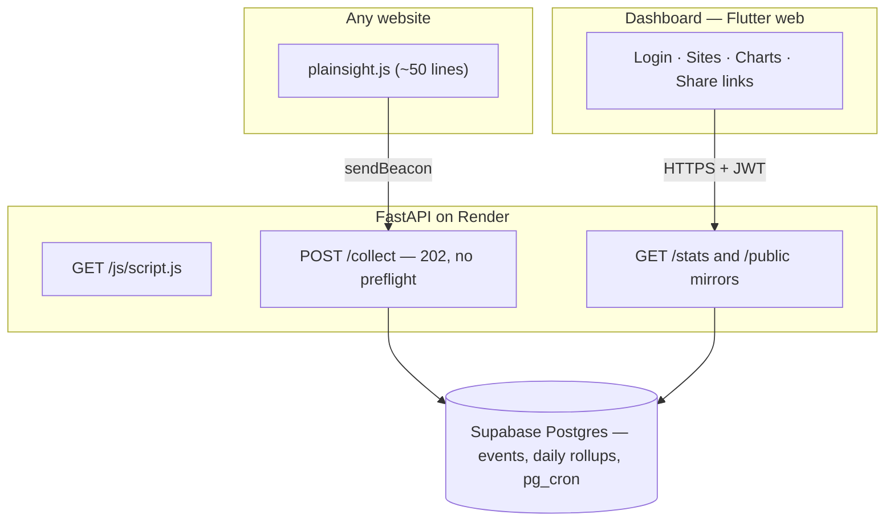
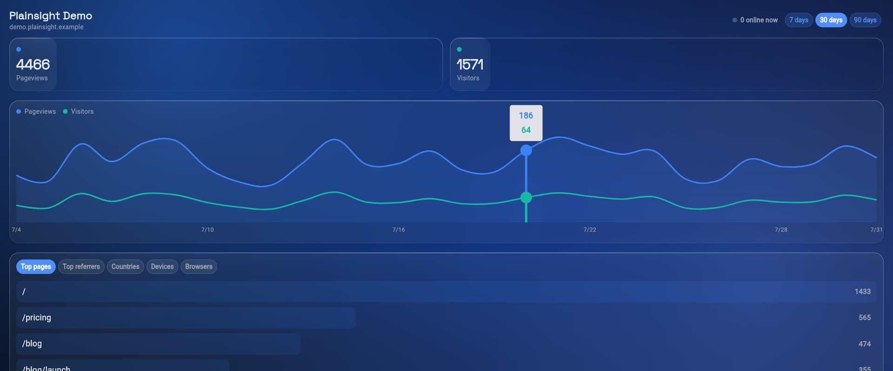
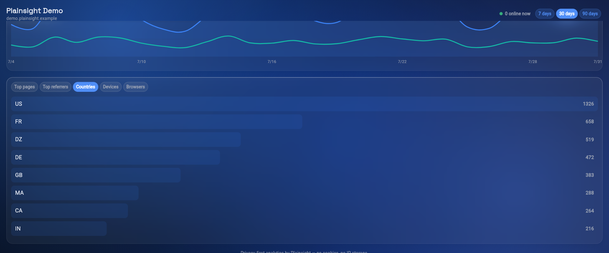
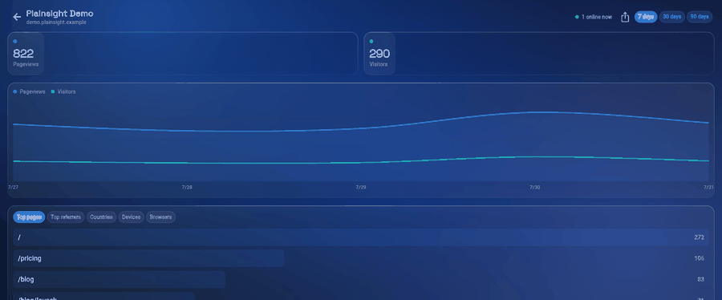

# Plainsight

Privacy-first web analytics you can self-host and actually understand. One ~50-line script, no cookies, no personal data stored — a live dashboard of visitors, pages, referrers, countries and devices.

[](https://github.com/KarimDtwen/plainsight/actions/workflows/ci.yml)


**Live:** [plainsight-ed30c.web.app](https://plainsight-ed30c.web.app) · **Demo (no login, 30 days of realistic seeded traffic):** [share link](https://plainsight-ed30c.web.app/share/W1I0tsrMU-2a) · **Signature demo hook:** the snippet is installed on [UniMatch](https://unimatch-a095f.web.app) — the traffic in this project's own dashboard for that site is real, not seeded.

## What it does

- **One-line install** — `<script defer src=".../js/script.js" data-site="KEY">` on any site; SPA route changes are counted too (`pushState` hooks).
- **No cookies, no PII** — visitors are counted with a daily-rotating salted hash (`sha256(daily_salt + site + ip + ua)`) computed server-side; the IP and raw user-agent are never stored, and salts are destroyed after 2 days, making re-identification impossible. Honors Do Not Track.
- **Live dashboard** — visitors/pageviews timeseries, top pages, referrers, countries, devices/browsers, and an "online now" counter.
- **Public share links** — a revocable read-only URL per site, no login needed.
- **Multi-site** — register any number of sites, each with its own key and dashboard.

## Architecture



- Ingestion is a CORS **simple request** (`text/plain` body via `sendBeacon`) — no preflight round-trip, the same trick Plausible uses.
- Historical queries read pre-aggregated `daily_rollups`; today is computed live from raw events and UNIONed in — all inside Postgres functions called via RPC.
- Nightly rollup + 90-day raw-event purge + salt destruction run in the database via **pg_cron** (the Render free tier sleeps, so the app can't be trusted with cron).
- The live counter **polls** every 10 s rather than holding a WebSocket — a deliberate fit for a free tier that cold-starts; the dashboard shows a "waking up" banner instead of failing.

## Privacy design

No cookies, no fingerprinting, no third-party trackers, no personal data at rest — the whole point:

- **Visitor identity is a daily-rotating hash**, computed server-side and never reversible: `visitor_hash = sha256(daily_salt + site_id + ip + user_agent)`. The IP address and raw user-agent string are used for exactly one request and then discarded — neither is ever written to the database.
- **The salt rotates every UTC day and is destroyed after 2 days.** Once a salt is gone, no past hash can ever be recomputed or linked back to an IP — re-identification is not a matter of access control, it's mathematically impossible after the fact.
- **Raw events are purged after 90 days**; only the pre-aggregated daily rollups (counts, no identifiers) persist beyond that.
- **Honors Do Not Track** — the snippet checks `navigator.doNotTrack` and exits immediately if set, before sending anything.
- **Country only, never city or precise location** — IP geolocation resolves to a 2-letter country code via a local database lookup, then the IP itself is discarded (see attribution below).
- **No cookies, ever** — visitor continuity within a day comes entirely from the hash, not client-side storage.

**GeoIP data** — country lookups use [DB-IP](https://db-ip.com)'s Country Lite database, licensed [CC BY 4.0](https://creativecommons.org/licenses/by/4.0/). Attribution: **IP Geolocation by DB-IP** ([db-ip.com](https://db-ip.com)).

## Status

| Piece | State |
|---|---|
| M0 — scaffold, CI, docs, skills | ✅ |
| M1 — ingestion + snippet + stats API | ✅ live E2E verified against real Supabase |
| M2 — dashboard + charts | ✅ live E2E verified |
| M3 — live counter + share links | ✅ live E2E verified |
| M4 — deploy + dogfood on [UniMatch](https://github.com/KarimDtwen/UniMatch) | ✅ live in production, real traffic confirmed |
| M5 — polish, screenshots, demo | ✅ |

## Screenshots

Dashboard and breakdown views, plus a share link being created and copied — all captured from the live demo site (30 days of realistic seeded traffic: weekday/weekend curves, weighted pages/referrers/countries/devices).





Or click the **demo share link** at the top of this README to explore it live, no login needed.

## Run the backend locally

```bash
cd backend
python -m venv .venv
.venv/Scripts/pip install -r requirements-dev.txt
cp .env.example .env        # fill in dev values
.venv/Scripts/python -m uvicorn main:app --reload --port 8000
.venv/Scripts/python -m pytest -q
```

## Run the dashboard

```bash
flutter pub get
flutter run -d chrome --web-port 5000 --dart-define=API_BASE_URL=http://localhost:8000
flutter analyze && flutter test
```

## Deployment

Backend → Render ([`render.yaml`](render.yaml), health check `/health`); dashboard → Firebase Hosting ([`firebase.json`](firebase.json)); database → Supabase (hand-numbered SQL in [`backend/migrations/`](backend/migrations/), applied in the SQL editor). Full runbook: [DEPLOYMENT.md](DEPLOYMENT.md).

**Live:**
- Dashboard: https://plainsight-ed30c.web.app
- Backend: https://plainsight-backend.onrender.com (free tier — sleeps after ~15 min idle, first request takes 30-60s to wake it)

Both are on free tiers, so the same instances host both the seeded demo site above and the real UniMatch traffic.

## Environment & secrets

All configuration is environment variables — see [`backend/.env.example`](backend/.env.example). `backend/.env` is git-ignored; production values live only in the Render dashboard (`sync: false`). Settings are validated at startup and fail fast in production with the **names** of missing variables, never values.
